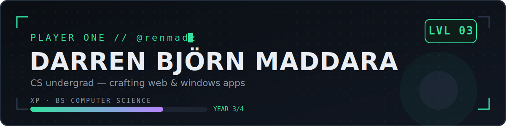

  

##  press start

Hey, I'm **Darren** — a 3rd-year BS Computer Science student who treats side projects like side quests. Currently speccing into **web apps** and **Windows apps**.

-  Year 3 of the Computer Science campaign — no skips, no cheat codes
-  Building for the browser and the desktop
-  Off-duty: logging movies and games (yes, I built trackers for both)

##  loadout

##  quest log

| quest | status | notes |
|---|---|---|
| **[after-credits](https://github.com/renmadz/after-credits)** |  main quest | Movie & TV tracker — watch status, ratings, rewatch history, TMDB integration. React · Node.js · PostgreSQL · Prisma |
| **[save-point](https://github.com/renmadz/save-point)** |  side quest | Video game tracker. Work in progress — save early, save often |

##  co-op invite

